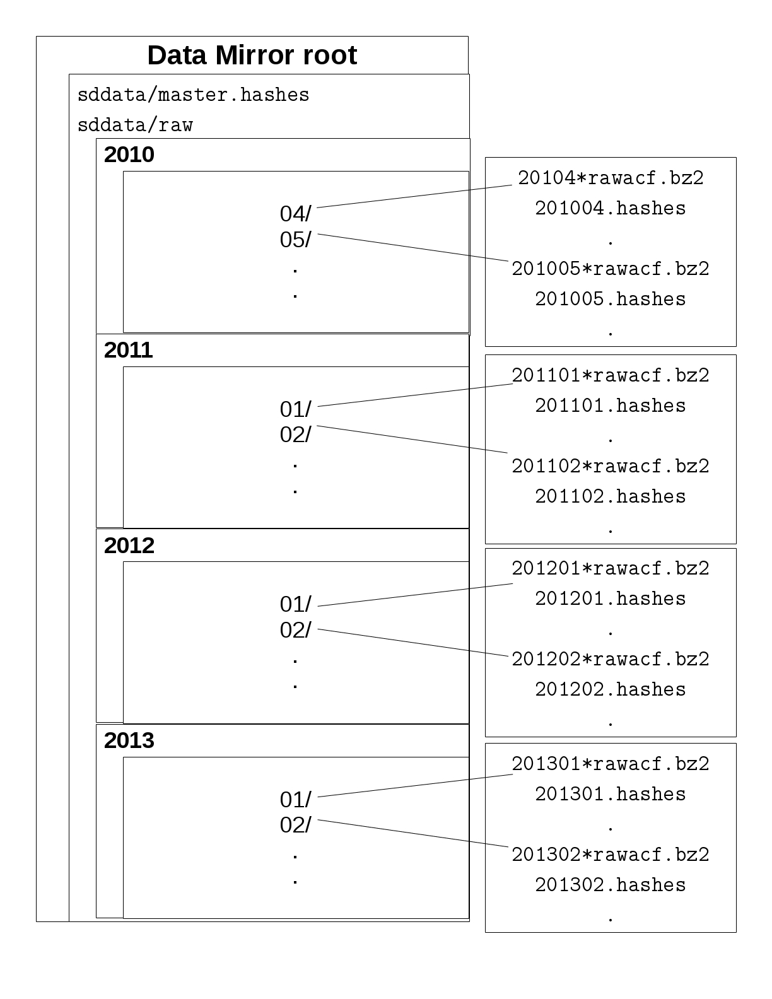

# Appendix D - USASK Data Distribution

## Historical overview

The Data Distribution system at the University of Saskatchewan has undergone many changes over the
lifetime of the SuperDARN project. Prior to hard drives being shipped to institutions, other forms
of media were written and shipped out. After hard drives were no longer used, the internet was
utilized along with NAS storage provided by Westgrid. After that, a scaled-up version of the NAS
system was put in place using Globus and storage provided by Compute Canada.

### Hard drive distribution

Prior to October 1st, 2013, JHU/APL (Robin Barnes/Stu Nylund) downloaded newly posted data from 
approximately 16 institutions nightly. This data was then processed through their scripts before 
they were eventually posted to the University of Saskatchewan's sdcopy server. Once four months 
worth of data (January to April, May to August, or September to December) are uploaded to sdcopy 
by JHU/APL, the data manager would write 17 hard-drives with copies of the four months worth of 
data. The hard drives were then shipped out to 16 institutions and one would be kept at the 
University of Saskatchewan for an extra backup.

In preparation for a distribution of data, the data manager at the UofS prepares 17 external 
hard drives by formatting them with an ext3 filesystem, partitioning them, and creating several 
directories for rawacf and fitacf data files to go. Fitacf files would be placed on the hard drive 
for radars that could not reliably transfer rawacf files.

After four months worth of data has been transferred to sdcopy by JHU/APL, the data is copied to 
six hard drives at a time (presently using USB external hard drives). This takes about two work 
days. After the data is copied to the six connected hard drives, the data on the hard drives is 
read and checked for consistency with the original data on sdcopy. This “diffing” takes roughly 
another work day.

Alongside the preparation of the hard drives, gap resolution would be done. The data manager 
would run a script on all the files, for all the radars over the past four month period. The 
output of the script is in the format:
20120318.14.rkn  --  20120318.22.rkn
20120319.00.rkn  --  20120319.14.rkn
20120321.16.rkn  --

This format means that there are no rawacf data files during the time period March 18th, at 
14:00 UTC to March 19th at 14:00 UTC. Then there are data files for March 19th 16:00 UTC until 
March 21st at 14:00 UTC. And there are no data files for March 21st at 16:00 UTC.

Emails are sent out to the individuals responsible for each radar, and they respond with 
information regarding the gaps, if they are real or not. If the gaps are not real, then they 
provide the data files to be included in the next distribution of hard drives. 

### NAS distribution via superdarn-cssdp.usask.ca

The SuperDARN Primary Data Mirror was implemented using WestGrid storage space. WestGrid is part 
of a consortium of High Performance Computing (HPC) resources available to academic researchers. 
The WestGrid storage space was accessed on a desktop computer running Linux in the SuperDARN 
Canada computer room, and was mounted as a Networked File System (NFS). In order to ensure 
adequate security, the protocol used was the Secure File Transfer Protocol (sftp), and it ran in a 
segregated environment on the Linux computer. The segregation allowed the users of the SuperDARN 
Primary Data Mirror read-only access to the data, and only the directories that contain the data. 
In this way, the rest of the file system was inaccessible to users.

The above image shows a view of the directory structure of the old SuperDARN data mirror.

A short description of the directory structure:
* `/sddata` – This is the root of the mirror.
* `/sddata/master.hashes` – This file is updated daily and contains a line for every `YYYYMM.hashes`
file on the mirror. It is useful for determining what months have new or changed data, as the 
hash for that specific hashes file will change. An example usage of this is to keep a local 
copy of this master.hashes file, and periodically compare your local copy with the server's 
copy to see what months you need to synchronize with.
* `/sddata/raw` – This is the directory for 'raw' data (currently, only 'rawacf' files).
* `/sddata/raw/2010` – Directory for 'raw' 2010 data.
* `/sddata/raw/2010/04` – Directory for 'raw' April 2010 data.
* `/sddata/raw/2010/04/201004.hashes` – An up-to-date list of all the hashes for files in the 
`/sddata/raw/2010/04/` directory. It is used by the example synchronization script sent out 
previously, as well as the gatekeeper to the mirror. Every time a new or updated file is placed 
in the `/sddata/raw/2010/04/` directory, it will be updated. It is not sorted.

## Current Distribution

The current system utilizes [Globus](<https://www.globus.org/>), which is a system for research data
management. At a very high level, it allows fast, parallel transfers of large data sets between 
`endpoints`. An endpoint can be a server in the cloud or your personal laptop or desktop. 

At SuperDARN Canada, we have access to the Globus endpoint on `cedar.computecanada.ca`, which has 
the Globus server software installed and acts as an endpoint. We are able to share subdirectories of
this storage with groups of users. In this way, we can customize the user's access to various data.
Currently, we use this sharing ability with a group of users to allow read-only access to the main
RAWACF and DAT file distribution. Alongside the main distribution, we expose the directory 
containing files removed from the distribution for any reason (blacklisted, failed in some way, etc).

A user wishing to have access to this data should contact the DDWG.  