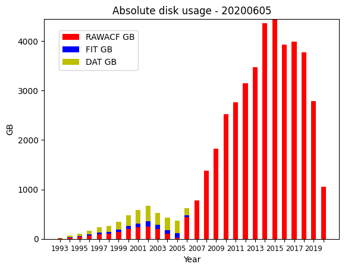

# DDWG Report: SuperDARN Workshop 2020

## Activity over the past year
1. Still doing online distribution, no hard drives requested
1. VT has purchased and set up two new NAS systems in Jan/Feb 2020, each has roughly 73TB capacity.
The group expects they may be able to purchase an additional two NAS systems to contain 1993 to 2018
data, this data is currently on two RAID arrays set up in 2012/13, with at least one failed disk 
among them.
1. Sessai/Yuka retrieved DAT files 
1. Judy retrieved DAT files
1. 'Deletions' directory made available on Globus
1. hdw.dat files responsibility passed to another working group
1. Data management audit performed, October 2019, please see a summary 
[here](https://github.com/SuperDARN/DDWG/blob/charter_update/audit_20191030.md)
1. Downtime summary:
    1. BAS mirror down temporarily from June 5th to 11th
    1. VT had downtime affecting data access for 2019 data, on October 31, 2019 to add more storage
    1. USASK temporary mirror had a hard drive failure & network switch failure in early March 2020
    1. USASK Globus mirror had downtime from March 16 - 22 2020 for upgrades
    1. USASK Globus mirror had downtime from March 23 - 30 due to filesystem issues
    1. BAS mirror had a downtime on May 8 2020 from 08:00 - 13:00 UTC for maintenance
1. Gap resolution done in October 2019 for September 2017 to August 2019 data inclusive
1. Issues brought up on mailing list (* - not yet resolved):
    1. *RAWACF files produced by `dattorawacf` with low-power thresholding issue
    1. *Nonsequential DAT files (records are out-of-order in time)
    1. Two blocked Canadian files from RKN/SAS due to main computer failure at RKN and old MAIN
computer from SAS shipped to RKN
    1. *Still 2255 DAT files to be recovered (most from 2000-2006, 14 files from 1995-1998)
    1. DAT hashes file on Globus issue
    1. A BPK file with a timing error was blocked
    1. A RKN file was blocked, as it was corrupt on the QNX filesystem, and not recoverable.
    1. Clyde River Borealis files were removed from the distribution, as they did not follow a naming
    1. DCE files were blocked from July 5 and July 6 2018 due to failures in the Phasing Matrix.
This is in addition to files from June 22nd 2018 - January 28th 2019. 
    1. A power outage at Kapuskasing caused some files to be corrupted from 20191208.17* to 
20191210.08*, they were blocked. 
    1. One JME file from 20200102.0000 was updated  
standard. They are currently in a separate directory (along with Saskatoon and Prince George data)
1. DDWG Mailing list updated with a representative from every group (*Still waiting to hear from Australian group*)
1. Future work: See the 'Action items' below

## Data summary

#### Absolute disk usage by year and data type

The above plot shows how many GB of storage are in the main distribution directories for RAWACF, 
FIT and DAT files. It is calculated using the command-line program `du -s`. The title of the plot
shows the year, month and day the plot was generated. Note that this includes RAWACF files that were
generated from DAT files.

## Meeting summary, June 3 2020 12:00 - 15:25 UTC
Please see the minutes/agenda for the meeting 
[here](https://github.com/SuperDARN/DDWG/blob/charter_update/meetings/minutes_20200603_12utc.md)

Please see relevant files on the DDWG github page 
[here](https://github.com/SuperDARN/DDWG/tree/charter_update) 

#### Action items

1. Kevin Krieger/USASK:
    1. Share results of audit (please see summary [here](https://github.com/SuperDARN/DDWG/blob/charter_update/audit_20191030.md))
    1. Reconcile issue numbers on github with historical issues
    1. Check consistency of responsibilities section with the PI agreement
    1. Check with DSWG about data level definitions, to make sure we are consistent with their docs
    1. Keep track of which files were converted from DAT to RAWACF and place in separate directory to 'dat'
    1. Make available a list of 'fixed' files alongside blocklist and failed files lists
    1. Add step 6 for gap resolution procedure: Inform DDWG of old files added
    1. Add to charter old file formats such as FIT that are also in the distribution (if any)
    1. Send message asking group to look for missing DAT files and original DAT files from the 
issue Evan outlined with low-pwr thresholding
1. DAWG:
    1. Provide tool for checking DAT files similar to the tool for checking RAWACF files
    1. Provide tool for checking RAWACF files that were converted to DAT with low-pwr issue
    1. Provide tools for fixing blocked files
    1. Provide guidance on possible fixes to DCE files that had phasing matrix issue
1. Kevin Sterne/Paul Breen/DDWG members who stage files for them:
    1. Work to get all PI institutions' radar data flowing to both VT and BAS
1. Data Policy Task Force:
    1. Who is responsible for fixing files?
    1. Should the DDWG be placing higher level data products in the scope?
1. PIs:
    1. Inform DDWG of appropriate responsibilities and policies
    1. Provide access to an updated PI agreement
    1. Discuss the current roles within the DDWG, should they be evolving?:
        1. Role of VT - Kevin Sterne handles getting data from many PI groups, automated except for tracking down data issues
        1. Role of BAS - Paul Breen handles getting data from many PI groups and maintaining mirror,
this is a risk, as we have heard from BAS that they don't have any resources for development 
        1. Role of USASK - Kevin Krieger maintains the Globus mirror and has been maintaining a 
*temporary* repo for ~3 years so that other groups would have time to transition to Globus. This 
temporary repo is a risk (failing hard drives, manual tasks) and an inefficient use of resources
and I recommend it to be decommissioned ASAP
    1. Discuss potential future servers within the SuperDARN Community. Dartmouth has expressed interest
1. DSWG:
    1. Add categories for blocking to level 1 standard documentation
    1. Provide guidance on data product level definitions (level 0, level 1, etc)

#### Other topics discussed

1. Charter/policies/procedures draft
1. Ease-of-use of Globus vs BAS repositories, some users have trouble with Globus, Kevin Krieger 
willing to help
1. Why are the USASK and BAS repositories not synchronized? Issues at BAS with retrieving data from
USASK, issues at USASK with temporary mirror
1. Where should file checks be done? Currently done before files go onto repositories, but could and
should be done on the user side as well.
1. Discussed possible SuperDARN-wide funding to have a dedicated resource for data distribution
