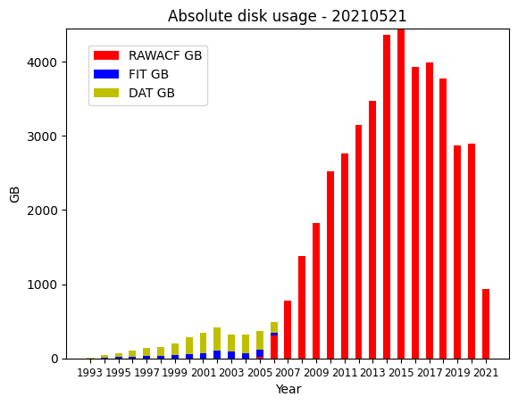

# DDWG Comprehensive Report for June 2020 - May 2021: SuperDARN Workshop 2021

## Activity over the past year

###  Major updates at BAS:
1. Started direct transfers from PI staging servers (see table in the quarterly DDWG reports).
1. Doing work to close the gap between Globus and BAS mirror differences
1. Usual activities such as requests for user accounts, additional keys, investigating file and access issues

###  Major updates at VT: 
1. VT conducted a move of their data servers to a 'temporary' location in September 2020. This resulted in
an outage of 5 days for incoming connections and 1 day for outgoing connections to staging servers. These 
servers are expected to move to a more permanent home in the future, but the date is TBD with a similar downtime expected.    
1. File issues are being tracked down as part of regular maintenance.
1. Some time is being spent in trying to understand changes in data distribution that have not been communicated to the WG. 
Explicit, direct and clear communication will be appreciated regarding changes.
1. A future TODO is to prioritize setting Paul Breen up with an account so that BAS can receive vks, fhe, fhw, gbr and kap data.
1. FITACF 3.0 files no longer shared via Globus

###  Major updates at USASK:
1. The temporary mirror at `superdarn-cssdp.usask.ca` was decommissioned in July/August 2020.
1. USASK was able to work with BAS and Compute Canada to give rsync access to `cedar.computecanada.ca` for Paul Breen.
1. The Globus example sync script was updated to work with Windows as well as Linux: [here](https://github.com/SuperDARNCanada/globus/blob/master/sync_radar_data_globus.py)
1. 2194 missing DAT files were retrieved from optical media and placed on the Globus mirror in July 2020.
1. Failed files (files that have failed some type of consistency check, are corrupt, etc) were made available on the Globus mirror in a separate directory to the main distribution of files, as well as a master list of failed files. This was done in August 2020.
1. A master list of updated files was made available on the Globus mirror in August 2020.
1. RAWACF files that were generated from `dattorawacf` for dat files that exist in the main distribution were moved to a separate directory on the Globus mirror. These were generated to aid in producing map files at usask. 

### Downtime summary:
1. VT had a very short downtime in the last week of August 2020
1. USASK had a hard drive failure at the end of August 28 2020, that caused a delay in data distribution activities.
1. The inode quota (how many files that are possible) of 10M files was reached on USASK's Compute Canada allocation. This resulted in a delay in data distribution activities before the quota could be increased. This was resolved in late August 2020.
1. Several power outages and a server failure of `sdcopy.usask.ca` resulted in delays in data distribution activities at usask in May 2021.
1. BAS had scheduled maintenance on the storage that hosts files on the weekend of March 27 2021.

### Other updates 
1. Gap resolution was started in September 2020 for September 2019 to August 2020 data inclusive. 
Several responses are yet to be received (see table in the quarterly DDWG reports)
1. PRIC began setup of a data mirror
1. The DPTF decided that the PI groups are responsible for fixing their own files if they want them in the distribution 
1. The DSWG decided upon a naming convention for data files with multiple data sets. The convention is to use a single lower-case character 'a-z'. A backlog of Borealis data is still being uploaded one month at a time.
1. The DDWG landing page was transitioned from the Virginia Tech website to the SuperDARN Github repository: [here](https://github.com/SuperDARN/DDWG/tree/master)

### Other Mailing list discussions 
1. There were several blocked files for hkw due to the timing computer being down during the time. See [here](https://github.com/SuperDARN/DDWG/issues/3)
1. An updated block diagram for an overview of how the Data distribution system works can be found [here](https://github.com/SuperDARN/DDWG/blob/master/img/SD_data_distribution_overview.pdf)
1. Incorrectly named dat-to-raw files were accidentally placed on the mirror, see issues [here](https://github.com/SuperDARN/DDWG/issues/38) and [here](https://github.com/SuperDARN/DDWG/issues/39)

## Data summary

#### Absolute disk usage by year and data type

The above plot shows how many GB of storage are in the main distribution directories for RAWACF, 
FIT and DAT files. It is calculated using the command-line program `du -s`. The title of the plot
shows the year, month and day the plot was generated. 

## Meeting summary, May 26 2021 12:00 - 13:45 UTC
Please see the minutes/agenda for the meeting 
[here](https://github.com/SuperDARN/DDWG/blob/master/meetings/minutes_20210526_12utc.md)

Please see relevant files on the DDWG github page 
[here](https://github.com/SuperDARN/DDWG/tree/master) 

