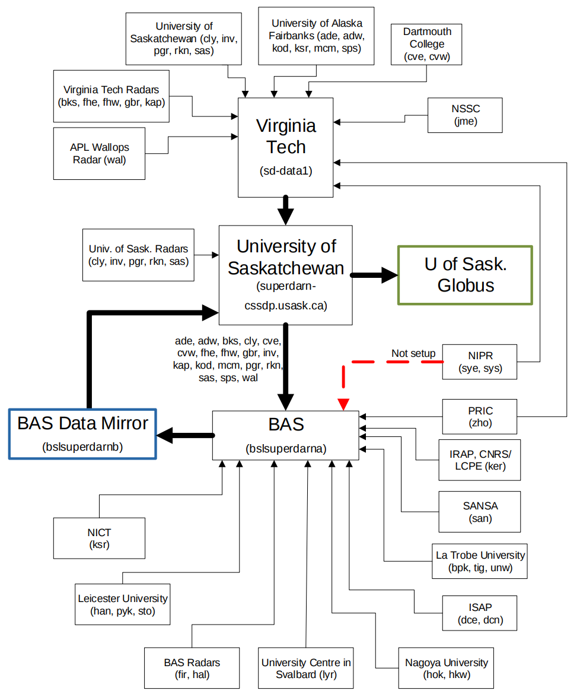

# Summary of SuperDARN Data Transfers
Kevin Sterne, May 1, 2020

This figure shows the general state of data transfers within the SuperDARN institutions
of Virginia Tech, University of Saskatchewan and the British Antarctic Survey (BAS), as it
was on May 1 2020.
The purpose is not to detail how the transfers occur (scp, sftp, etc.), but to provide a high 
level overview of how things are working. This figure does not reflect or account for
current radar operating status, so some transfers are empty/ghost transfers due to
operation issues at the radar.

## Virginia Tech Data Collection
As of May 1 2020.

The Virginia Tech (VT) system took over the single point of data collection from the PI
institutions from John Hopkins University/Applied Physics Lab (JHU/APL) in Sept 2013. This has 
continued with the majority of radars/PI institutions even with the BAS
data mirror coming online though they are not shown in the figure above. Of these, there
are a number intermittent data downloads that do not occur on an automatic basis. These
sporadic downloads are run manually due to data integrity issues at the PI institution
which have not had any movement towards correcting or feedback in a number of
months.

A subset of the radar files (shown in the figure above) that are being collected at VT are
then staged up for the University of Saskatchewan to download. This is a legacy setup
from years past where data is transferred to the University of Saskatchewan to be
distributed out from their institution.

## University of Saskatchewan Data Collection
As of December 10 2021.

The University of Saskatchewan downloads files from the VT `sd-data1` server, the NSSC data mirror, as
well as the BAS data mirror. These downloads are first staged onto the `superdarn-cssdp`
server and then transferred over to the Globus system (`cedar.computecanada.ca`). In addition, the University of
Saskatchewan downloads its own radars (cly, inv, pgr, rkn, sas) to the `superdarn-cssdp`
server in duplication with the path through the VT system. This is a system loop check to
make sure files are maintaining integrity while being processed through the VT system.

The `superdarn-cssdp` server checks the hashes files for all files for the
BAS mirror, NSSC mirror, and the Globus mirror to compare them. Files that are not found on the
Globus mirror are downloaded from the BAS or NSSC mirrors to the `superdarn-cssdp` server to be
placed on the Globus server. The BAS and NSSC servers have rsync access to the `cedar.computecanada.ca` server
in order to synchronize to it.

## British Antarctic Survey Data Mirror Data Collection
As of May 1 2020.

The BAS data mirror became operational in 2016 and began collecting radar data for a
subset of radars that had connections to the United Kingdom, Europe or Asia PI
institutions. An even smaller subset of radar data is being transferred to the BAS data
mirror first and not in parallel with transfers to the VT server. The BAS data mirror
provides a number of open source transfer protocols to SuperDARN and other users. The
data ingestion or collection occurs on the bslsuperdarna server while data 
access/distribution occurs on the bslsuperdarnb server. In addition, there is a well
documented catalogue API and web apps server that allows users to collect metadata
(such as file content checksums) through http queries. The catalogue API and web apps
server is run on the bslsuperdarnc server.

For the small subset of radars that are transferred only to the BAS data mirror first, both
VT and University of Saskatchewan download files from the BAS data mirror just as any
other user of SuperDARN data might download data.

## National Space Science Center, Chinese Academy of Sciences Data Mirror Data Collection
As of December 10 2021

The NSSC data mirror became operational in 2021 and began collecting radar data.
The NSSC data mirror synchronizes to the USASK mirror using Globus, but they also have
access to cedar.computecanada.ca via rsync in the same way that BAS does. 
They also synchronize with the BAS mirror via rsync.
